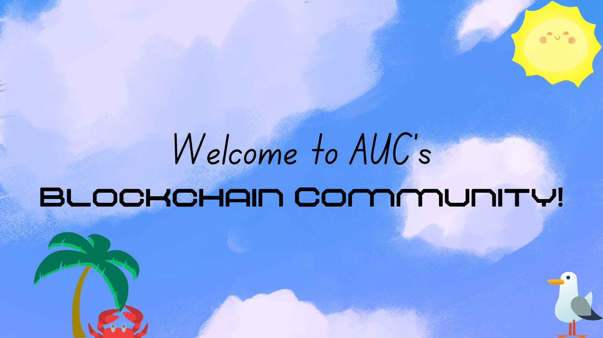

<h1 align="center">Hello! We Are AUC's Blockchain Community</h1>

<h3 align="center">A community welcoming anyone wanting to learn Blockchains in Arabic and English</h3>

- 🌱 our Activities **Weekly Meetups, Lectures, Tutorials, Discussions**
- 📫 Reach our Community Leader **Kareemikassab@aucegypt.edu**

<h3 align="left">Join Discord:</h3>

<h3 align="left">Languages and Tools:</h3>

          

